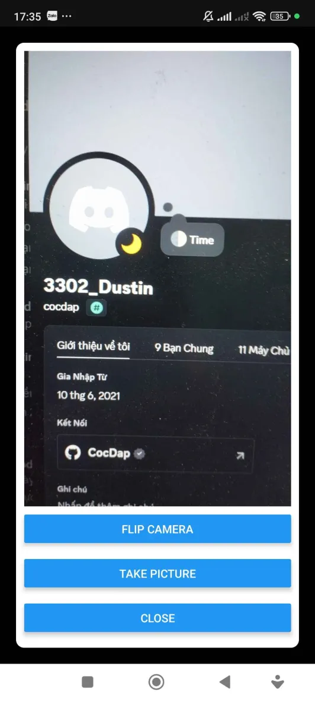
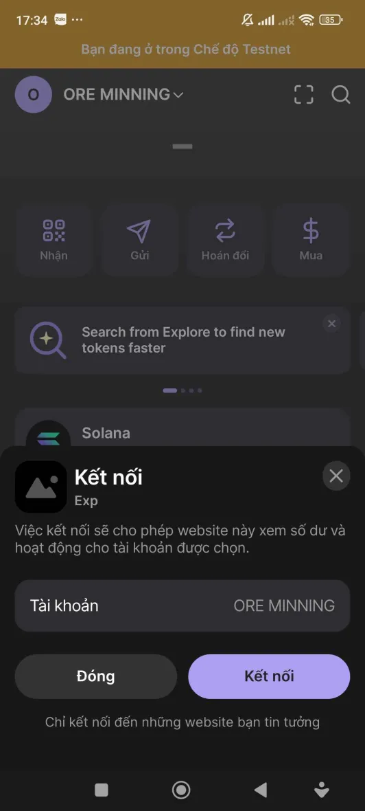
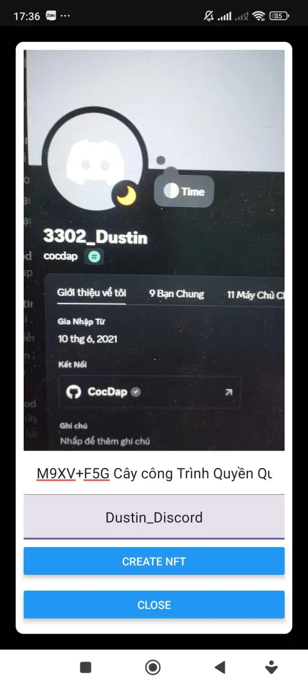

# Solana Fellowship Program 2024 - Module 7 -  Solana Mobile

Build an app that captures an image through the camera, mints an NFT with that image, and adds the current location longitude, latitude in the metadata


## Features
+ Mint NFT through capture images camera 

##  How to use
### Step 1 - Take a picture

[]


### Step 2 - Connect wallet 

[]

### Step 3 - Mint NFT 

[]


## Quick Start

### Requirements

- A free [Expo](https://expo.dev/) account.
- Android device/emulator for testing the app
  - Install an MWA-compatible wallet app on your device/emulator.
- If using Expo's cloud service `eas build`, no additional setup is needed.
- For local builds:
  - Set up React Native and Android environment
    [guide](https://docs.solanamobile.com/getting-started/development-setup)

### Initialization

Run the following CLI commands:

```
git clone <repo>
yarn
yarn start
```

### Building and Running the App

After initializing the app, follow the
**["Running the app"](https://docs.solanamobile.com/react-native/expo#running-the-app)**
guide to launch the sample as a custom development build.

## Notes

- This app is fully functional only on Android. iOS is not supported.
- The project uses the `expo-camera` plugin, which is not supported on Android emulators for Expo v50.0.0 and below. Testing must be done on a physical Android device. For more information, see
  [platform compatibility](https://docs.expo.dev/versions/v50.0.0/sdk/camera/#platform-compatibility)


